# Assignment -2

### Docker network named "my_network" 
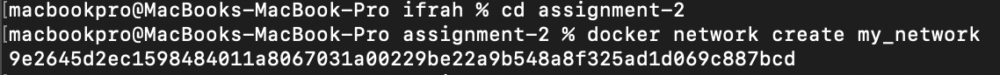

### Docker container using the "nginx" image and connect it to the "my_network" network. Name the container "nginx_container"

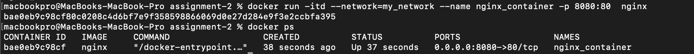

### "nginx" default page is accessible on your host machine at http://localhost:8080.

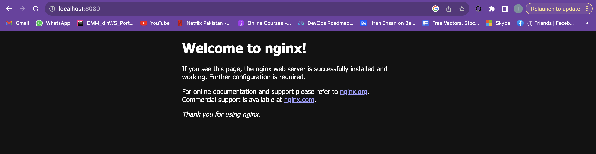

### new Docker container using the "httpd" image and connect it to the "my_network" network. Name the container "httpd_container"

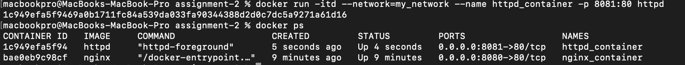

### "httpd" default page is accessible on your host machine at http://localhost:8081.

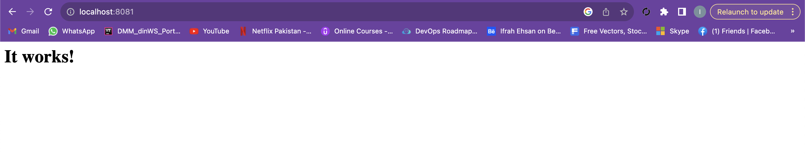

### "docker network inspect" command to display information about the "my_network" network

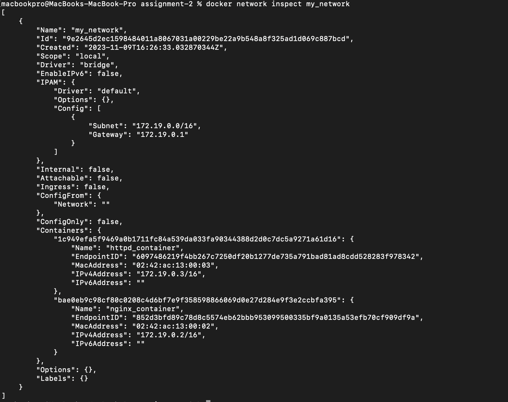

### stop & remove nginx_contaienr

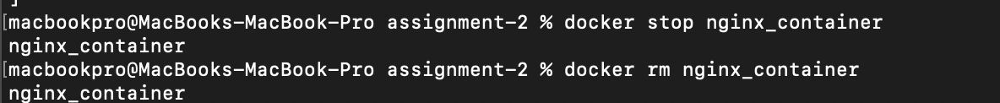

### new Docker container using the "nginx" image and connect it to the "my_network" network. Name the container "nginx_container_2"

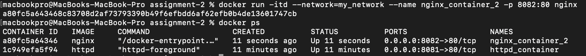

### "nginx" default page is accessible on your host machine at http://localhost:8082.

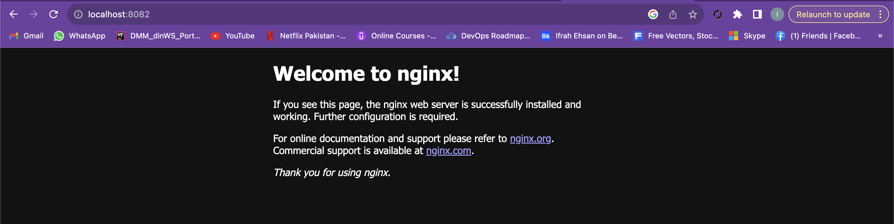

### "docker container ls" command to display information about all running containers.

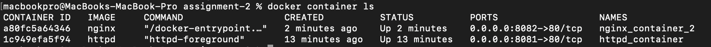

### Stop and remove all containers

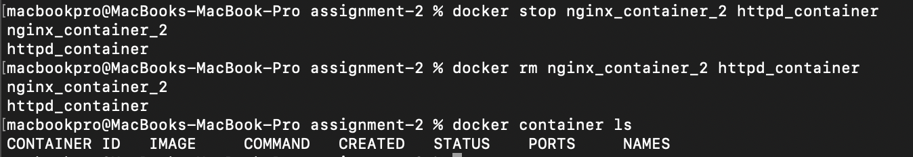

### Cleanup: Remove the "my_network" network.
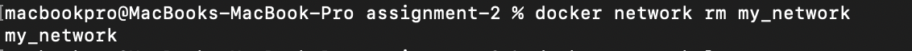